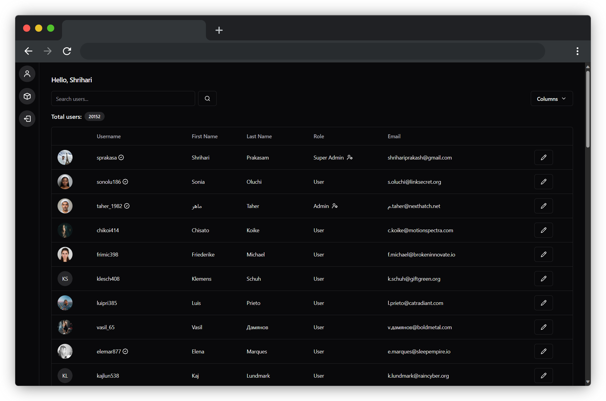

# Nitrogen: Beautiful admin panel for your Liquid instances.

What is Liquid?

Liquid is a Docker-based open-source authentication server that supercharges your product development by offering out of the box APIs for features like follow-unfollow, blocking, and banning so that you can focus on just your application logic. 🚀

Read more about the Liquid project [here](https://github.com/shrihari-prakash/liquid).

Nitrogen features:

- **Effortless Integration with Liquid**: Simply build the project with your Liquid hostname and client ID and you are all good to go!
- **User Info Editor**: Quick and intuitive user info editing.
- **Admin Controls**: Verify, Ban or restrict users right from your Nitrogen instance.
- **Permissions Editor**: Nitrogen offers an intuitive permissions editor for granting precise access to Liquid instance administrators.
- **Highly Responsive**: Nitrogen was designed with mobile first approach making user management possible from anywhere!
