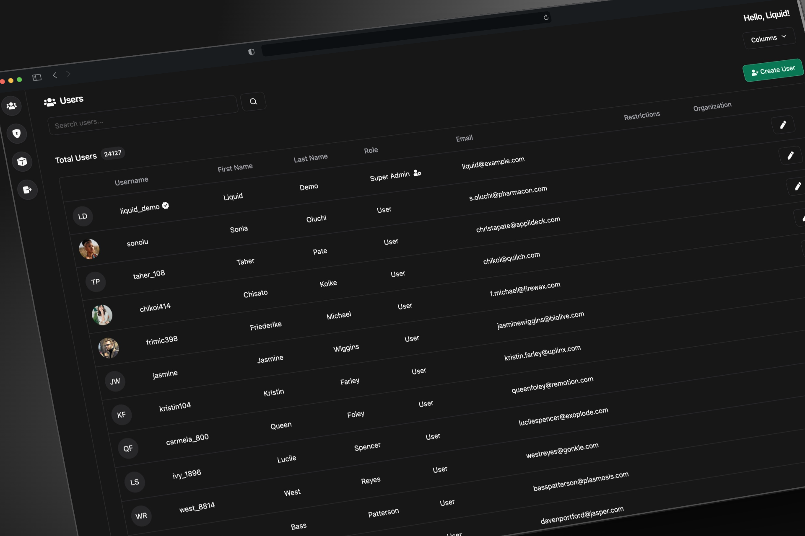

# ⚙️ Nitrogen: Beautiful admin panel for your Liquid instances.⚙️



### What are Liquid and Nitrogen?

Liquid is an open-source authentication server built on Docker, designed to accelerate your product development by providing ready-to-use APIs for features like OAuth, follow/unfollow, blocking, and banning. This allows you to focus solely on your application's logic. 🚀

Read more about the Liquid project [here](https://github.com/shrihari-prakash/liquid).

Once you have a Liquid instance set up, Nitrogen provides a user interface for managing administrative tasks.

### ⭐ Features:

- **Effortless Integration with Liquid:** Just configure the project / docker image with your Liquid hostname and client ID, and you're ready to go!
- **User Info Editor:** Quick and intuitive user info editing.
- **Admin Controls:** Verify, Ban or restrict users right from your Nitrogen instance.
- **Permissions Editor:** Nitrogen offers an intuitive permissions editor for granting precise access to users in your Liquid instance.
- **Highly Responsive:** Built with a mobile-first approach, Nitrogen ensures user management is accessible from anywhere!

### 🔧 Installation:

> [!IMPORTANT]
> Before preparing for the installation, make sure the host of your nitrogen instance is present in the redirect URI list of the client you intend to use. For instance, local host of Nitrogen after running the docker image would be http://localhost:2001.

#### Docker (Recommended):
1. Run the following command
```
docker run -e LIQUID_HOST=https://your.liquid.instance -e LIQUID_CLIENT_ID=application_client -p 2001:80 --name nitrogen shrihariprakash/nitrogen:latest
```
2. Open https://localhost:2001 to see the admin panel.
3. The docker version uses nginx to serve pages and uses a very minimal configuration without https by default. If you'd like to customize the nginx config, mount your config file to `/etc/nginx/conf.d/default.conf` of the docker image.

#### Manual Build:
1. Create a .env file in project root with the following variables:

```properties
VITE_LIQUID_HOST=https://your.liquid.instance
VITE_LIQUID_CLIENT_ID=application_client
```

2. Run `npm install`.
3. Run `npm run build`.
4. Host the `dist` folder in a static server.
5. Add the host of your Nitrogen instance to the Redirect URI list of the client specified in `VITE_LIQUID_CLIENT_ID`.
